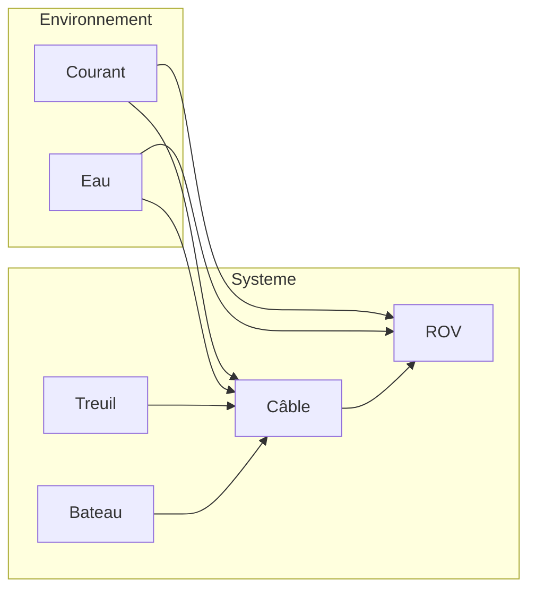

# Contexte projet

## Table des matières

1. Contexte général
2. Objectifs fonctionnels
3. Objectifs techniques
4. Hypothèses et conventions
5. Périmètre actuel
6. Livrables attendus
7. Limites connues (implémentation actuelle)
8. Public visé
9. Schéma global

## 1. Contexte général

Le projet ROV vise à simuler la dynamique d’un système complet bateau–câble–ROV
dans un plan 2D. Le simulateur permet de reproduire les phénomènes principaux
qui gouvernent l’évolution du ROV et du câble ombilical : traînée hydrodynamique,
poussée d’Archimède, poids apparent, tensions du câble, contraintes de surface,
et influence du courant.

Le code cible un usage d’ingénierie et de recherche : exploration de scénarios,
analyses de sensibilité, calibration, et aide à la préparation de missions.

## 2. Objectifs fonctionnels

- Simuler le mouvement du ROV et l’évolution du câble dans un environnement
  aquatique, avec contraintes de surface et de longueur de câble.
- Reproduire des scénarios de commande (forces, vitesse du bateau, dL/dt).
- Fournir une visualisation interactive des grandeurs principales.
- Permettre la configuration des paramètres physiques via fichiers de mission.

## 3. Objectifs techniques

- Modélisation dynamique dans un cadre 2D cohérent avec les conventions de signe.
- Couplage entre le ROV, le câble et le bateau par la tension.
- Résolution numérique robuste (intégration temporelle et solveur de câble).
- Possibilité d’extension : ajout de nouvelles lois de commande, de profils
  de courant ou de modèles améliorés.

## 4. Hypothèses et conventions

- Modèle 2D (plan x–y).
- Convention verticale : y < 0 correspond à la profondeur (sous la surface),
  y = 0 à la surface.
- Le bateau reste à la surface (y = 0).
- La longueur du câble est contrôlée par la consigne dL/dt et est intégrée
  dans le vecteur d’état.
- Les contraintes physiques imposent que le câble ne soit jamais au-dessus
  de la surface (y <= 0).

## 5. Périmètre actuel

- Interface utilisateur PyQt (application native Windows).
- Paramétrage par mission via fichiers JSON.
- Visualisations temps réel (courbes de position, tension, commande dL/dt).
- Solveur de câble statique et dynamique, incluant un modèle de courant.

## 6. Livrables attendus

- Simulateur exécutable via interface PyQt.
- Scripts et exemples d’utilisation (lancement, tests, missions).
- Documentation technique et scientifique sous `docs/` (point d’entrée : `00_table_des_matieres.md`), incluant modélisation, implémentation, tests et spécifications (ex. `dae_cable_rov_spec.md`).

## 7. Limites connues (implémentation actuelle)

- Modèle 2D uniquement.
- Hypothèses simplificatrices sur le câble (discrétisation en segments).
- Modèle hydrodynamique simplifié (traînée quadratique).
- Paramètres calibrables mais pas d’optimisation automatique intégrée.

## 8. Public visé

- Ingénieurs et chercheurs travaillant sur des systèmes ROV.
- Équipes de conception ou d’opérations souhaitant évaluer des scénarios.
- Développeurs appelés à maintenir ou étendre le simulateur.

## 9. Schéma global

