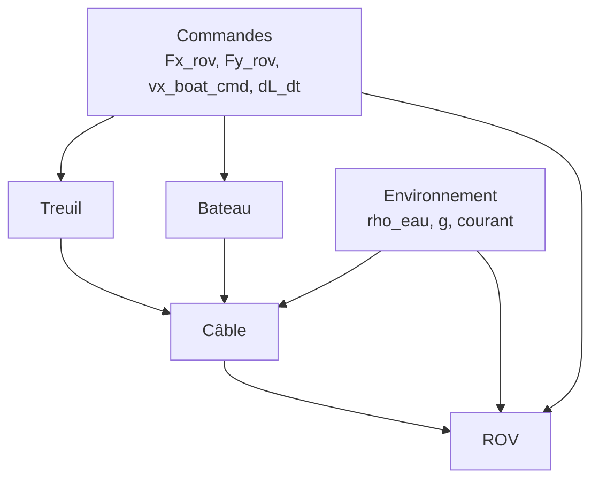

# Modélisation du système bateau–treuil–câble–ROV

## Table des matières

1. Repère et conventions
2. Variables d'état et commandes
3. Modèle ROV
4. Modèle Bateau
5. Modèle Câble
6. Conditions aux limites
7. Influence du treuil (dL/dt)
8. Profil de courant
9. Schéma des interactions
10. Récapitulatif des forces sur le ROV
11. Récapitulatif des forces sur le câble
12. Conventions de signe détaillées
13. Construction d'un point isocèle cible

## 1. Repère et conventions

- Modèle 2D (x horizontal, y vertical).
- Convention de signe : y < 0 sous la surface, y = 0 à la surface.
- Le bateau est contraint à y = 0.
- Le câble et le ROV ne peuvent pas remonter au-dessus de la surface.

**Convention de signe pour les forces verticales** :

- **Positif** = vers le haut (surface)
- **Négatif** = vers le bas (fond)

## 2. Variables d’état et commandes

### 2.1 Vecteur d’état

L’état global est défini par :

- ROV : position et vitesse (x_rov, y_rov, vx_rov, vy_rov)
- Bateau : position et vitesse (x_boat, vx_boat)
- Câble : positions nodales (x_cable, y_cable) et tensions nodales T
- Longueur de câble : L

Taille du vecteur d’état :

```
6 + 3*(N+1) + 1
```

où N est le nombre de segments du câble.

### 2.2 Commandes

Le vecteur de commande u(t) contient :

- Fx_rov : force horizontale sur le ROV (N)
- Fy_rov : force verticale sur le ROV (N)
- vx_boat_cmd : vitesse commandée du bateau (m/s)
- dL_dt : variation de la longueur de câble (m/s)

## 3. Modèle ROV

### 3.1 Traînée

Traînée quadratique selon la vitesse relative :

```
Fx_drag = -Cx * 0.5 * rho_eau * Sx * vx_rel * |vx_rel|
Fy_drag = -Cy * 0.5 * rho_eau * Sy * vy * |vy|
```

où :

- vx_rel = vx_rov - v_current(y_rov)
- Sx = a*h (section frontale horizontale)
- Sy = a*b (section frontale verticale)

### 3.2 Poids et poussée d'Archimède

```
F_weight = m * g
F_buoyancy = rho_eau * V * g
F_apparent_weight = F_buoyancy - F_weight
```

**Convention de signe** :

- `F_apparent_weight > 0` : flottabilité positive (ROV plus léger que l'eau, force vers le haut)
- `F_apparent_weight < 0` : flottabilité négative (ROV plus lourd que l'eau, force vers le bas)

### 3.3 Équations de mouvement (ROV)

Avec la tension du câble appliquée selon l'angle local :

```
dvx_rov/dt = (Fx_drag + T_rov * cos(theta0) + Fx_rov) / m
dvy_rov/dt = (F_apparent_weight + Fy_drag + T_rov * sin(theta0) + Fy_rov) / m
```

**Convention de signe pour les forces verticales** :

- Toutes les forces verticales sont positives vers le haut (surface), négatives vers le bas (fond)
- `F_apparent_weight` : positif si flottabilité positive (vers le haut)
- `Fy_drag` : traînée verticale (positif vers le haut, négatif vers le bas)
- `T_rov * sin(theta0)` : composante verticale de la tension (positif vers le haut)
- `Fy_rov` : commande verticale (positif vers le haut, négatif vers le bas)

La direction (cos(theta0), sin(theta0)) est calculée à partir du segment du câble
adjacent au ROV (orientation vers le bateau). `sin(theta0) > 0` indique une direction vers le haut.

## 4. Modèle Bateau

Le bateau est modélisé avec une commande de vitesse et une force de propulsion
qui s’oppose à la traînée :

```
F_prop = k_prop * (v_cmd - v_current) - k_drag * v_current * |v_current|
dvx_boat/dt = F_prop / m_boat
```

Dans l’implémentation actuelle, l’effet de la tension du câble sur le bateau est
négligé pour le mouvement horizontal.

## 5. Modèle Câble

### 5.1 Discrétisation

Le câble est discrétisé en N segments, N+1 nœuds. Chaque nœud a des coordonnées
(x_i, y_i) et une tension T_i. La longueur totale est L.

### 5.2 Longueur du câble et contraintes

**Longueur L(t)** :

La longueur du câble est entièrement déterminée par la commande `dL/dt` :

```
L(t) = L(0) + ∫₀ᵗ dL/dt dt
```

où `L(0)` est la longueur initiale. La longueur `L(t)` est **fixe** à chaque instant et ne doit **jamais** être ajustée en cours d'itération.

**Contraintes critiques à chaque itération** :

1. **Longueur exacte** : La longueur totale du câble doit être exactement égale à `L(t)`.

2. **Segments de longueur égale** : Les N segments du câble doivent tous avoir la même longueur `ds = L(t) / N`.

3. **Extrémités** :
   - Premier point (bateau) : `(x_boat, 0.0)` avec abscisse curviligne `s = 0`
   - Dernier point (ROV) : `(x_rov, y_rov)` avec abscisse curviligne `s = L(t)`

4. **Slack** : Le slack est défini comme `slack = L(t) - D_straight`, où `D_straight` est la distance en ligne droite entre le bateau et le ROV. Le slack doit **toujours être >= 0**. Si le slack devient négatif, la tension au ROV est ajustée pour tirer le ROV vers le bateau et ramener le slack à >= 0.

### 5.3 Tension et géométrie

Deux régimes sont utilisés :

1) **Statique (caténaire)**

   - Si le câble est plus dense que l'eau : la solution de référence est une
     caténaire reliant le bateau au ROV.
   - Si le slack est négatif (L < distance droite) : la tension au ROV est
     augmentée pour forcer slack >= 0, et la géométrie est forcée rectiligne.
   - Lorsque la longueur de câble est **proche** de la distance droite
     (`r = L / L_straight ≈ 1`), le modèle n’effectue plus un basculement
     binaire entre « ligne droite » et « caténaire ». À la place, le solveur
     construit **deux géométries** (une caténaire et une ligne droite) et fait
     un **blending continu** entre les deux en fonction de r :

     - pour `r = 1`, la solution est 100 % rectiligne ;
     - pour `r ≥ 1.01`, la solution est 100 % caténaire ;
     - entre les deux, la transition est linéaire.

   Cette interpolation continue supprime les discontinuités numériques quand le
   câble passe d’un régime quasi tendu à un régime nettement fléchi. Dans tous
   les cas, la géométrie obtenue est ensuite **renormalisée** pour respecter
   exactement la longueur `L(t)` et garantir des segments de même longueur.

2) **Dynamique**
   
   - Résolution du profil de câble avec forces hydrodynamiques et poids apparent
   - Mise à jour des tensions via relaxation temporelle
   - Ajustement de la tension au ROV si slack < 0 pour garantir slack >= 0

### 5.3 Poids apparent du câble

```
weight_per_unit = (rho_cable - rho_eau) * A_cable * g
```

### 5.4 Forces hydrodynamiques (câble)

**Calcul avec repère local (U, V)** :

Pour chaque segment, la traînée est calculée dans un repère local :

- **U** : Vecteur tangent unitaire (direction du segment)

- **V** : Vecteur normal unitaire (perpendiculaire à U)
1. **Projection de la vitesse relative** dans le repère local :
   
   ```
   v_longitudinal = v_rel · U    (composante le long du segment)
   v_perpendicular = v_rel · V   (composante perpendiculaire)
   ```

2. **Traînée longitudinale** (frottement de surface) :
   
   ```
   F_longitudinal = Cf_cable * 0.5 * rho_eau * π * d * ds * v_longitudinal * |v_longitudinal|
   ```
   
   où `Cf_cable` est le coefficient de frottement longitudinal (typiquement 0.04).

3. **Traînée perpendiculaire** (traînée normale) :
   
   ```
   F_perpendicular = Cx_cable * 0.5 * rho_eau * d * ds * v_perpendicular * |v_perpendicular|
   ```
   
   où `Cx_cable` est le coefficient de traînée perpendiculaire (typiquement 1.2).

4. **Reprojection dans le repère global** :
   
   ```
   F_drag = F_longitudinal * U + F_perpendicular * V
   ```

Cette approche permet de distinguer correctement la traînée selon l'angle entre
le courant et l'orientation du segment.  

Dans le solveur, l’influence du courant sur la **géométrie statique** du câble
est modulée par un critère d’ordre de grandeur : si la **traînée horizontale
totale** reste faible devant le **poids apparent total** (par exemple, ratio
traînée/poids < 10 %), le solveur conserve la **caténaire initiale** sans lancer
les itérations de déformation ; sinon, il active une boucle itérative qui
déforme progressivement le câble sous l’effet du courant, avec renormalisation
de longueur à chaque étape significative.

## 6. Conditions aux limites

- Bateau : y = 0, position horizontale libre.
- ROV : y <= 0 (si y > 0, la vitesse verticale est corrigée).
- Câble : tous les points sont contraints à y <= 0.
- Longueur : normalisation pour imposer L.

## 7. Influence du treuil (dL/dt)

La longueur du câble est un état dynamique :

```
dL/dt = u["dL_dt"]
```

La valeur de L est transmise au solveur de câble à chaque itération.

## 8. Profil de courant

Le courant est défini par un profil en fonction de la profondeur (y) :

- Valeur constante
- Table profondeur/vitesse interpolée
- Chaîne formatée (ex: "0:0;10:0.5;50:1.0")

Le courant influe sur la traînée du ROV et du câble.

## 9. Schéma des interactions



---

## 10. Récapitulatif des forces sur le ROV

### 10.1 Vue d'ensemble

Le ROV est soumis à quatre types de forces :

| Force | Description |
|-------|-------------|
| **Fx_drag_rov / Fy_drag_rov** | Traînée hydrodynamique (résistance au mouvement) |
| **Fx_traction_rov / Fy_traction_rov** | Traction du câble sur le ROV |
| **Fx_cmd_rov / Fy_cmd_rov** | Commandes de propulsion (pilote) |
| **Fy_rov_app_w** | Poids apparent (flottabilité - poids) |

### 10.2 Somme des forces

**Horizontales** :
```
Fx_rov_total = Fx_drag_rov + Fx_traction_rov + Fx_cmd_rov
```

**Verticales** :
```
Fy_rov_total = Fy_rov_app_w + Fy_drag_rov + Fy_traction_rov + Fy_cmd_rov
```

### 10.3 Origine des forces

- **Traînée** : `F_drag = -0.5 * rho * C * S * v * |v|` (résistance hydrodynamique)
- **Traction** : `F_traction = T_rov * (-Urov)` où Urov est le vecteur unitaire du câble au ROV
- **Poids apparent** : `F_apparent_weight = F_buoyancy - F_weight` (positif si flottabilité positive)
- **Commandes** : Forces des propulseurs (pilote)

### 10.4 Équations de mouvement

```
dvx_rov/dt = Fx_rov_total / m_rov
dvy_rov/dt = Fy_rov_total / m_rov
```

---

## 11. Récapitulatif des forces sur le câble

### 11.1 Vue d'ensemble

Le câble est soumis à :

1. **Forces aux extrémités** : Tractions du bateau et du ROV
2. **Forces distribuées** : Poids apparent et traînée hydrodynamique sur chaque segment

### 11.2 Forces aux extrémités

**Traction du bateau** : `F_bateau = -T_bateau * U_bateau` (le bateau tire le câble vers lui)

**Traction du ROV** : `F_rov = T_rov * U_rov` (le ROV tire le câble vers lui)

### 11.3 Forces distribuées

**Poids apparent par segment** :
```
Fy_weight_segment = -(rho_cable - rho_eau) * A_cable * g * ds
```
- Négatif si câble plus dense que l'eau (vers le bas)
- Positif si câble plus léger que l'eau (vers le haut)

**Traînée hydrodynamique** : Calculée dans le repère local (U, V) de chaque segment :
- **Traînée longitudinale** (frottement) : `Cf_cable * 0.5 * rho_eau * π * d * ds * v_longitudinal * |v_longitudinal|`
- **Traînée perpendiculaire** (normale) : `Cx_cable * 0.5 * rho_eau * d * ds * v_perpendicular * |v_perpendicular|`
- Reprojection dans le repère global : `F_drag = F_longitudinal * U + F_perpendicular * V`

### 11.4 Équilibre du câble

À l'équilibre : `F_bateau + F_rov + F_poids + F_drag ≈ 0`

### 11.5 Variables stockées dans `data`

- `Fx_drag_cable`, `Fy_drag_cable` : Traînée totale (repère local)
- `Fx_drag_cable_longitudinal`, `Fy_drag_cable_longitudinal` : Composante frottement
- `Fx_drag_cable_perpendicular`, `Fy_drag_cable_perpendicular` : Composante normale
- `Fy_cable_app_w` : Poids apparent total (négatif vers le bas)

---

## 12. Conventions de signe détaillées

### 12.1 Repère spatial

- **Axe X** : Horizontal (positif vers la droite/avant)
- **Axe Y** : Vertical
  - **y < 0** : Sous la surface (profondeur)
  - **y = 0** : Surface de l'eau
  - **y > 0** : Au-dessus de la surface (interdit pour le ROV et le câble)

### 12.2 Forces verticales (ROV)

**Convention unifiée** : Positif = vers le haut (surface), Négatif = vers le bas (fond)

S'applique à : `Fy_drag_rov`, `Fy_traction_rov`, `Fy_cmd_rov`, `Fy_rov_app_w`, `Fy_rov_total`

### 12.3 Poids apparent

```
F_apparent_weight = F_buoyancy - F_weight
```
- **> 0** : Flottabilité positive (force vers le haut)
- **< 0** : Flottabilité négative (force vers le bas)

### 12.4 Traînée

- **Horizontale** : `Fx_drag = -Cx * 0.5 * rho * Sx * vx_rel * |vx_rel|` (négatif si avance)
- **Verticale** : `Fy_drag = -Cy * 0.5 * rho * Sy * vy * |vy|` (négatif si monte)

### 12.5 Force de traction

```
Fy_traction = T_rov * (-Urov_y)
```
La traction est positive vers le haut quand le câble tire le ROV vers la surface.

### 12.6 Forces verticales (câble)

Pour le câble : **Négatif** = vers le bas, **Positif** = vers le haut (cohérent avec y < 0 = profondeur).

---

## 13. Construction d'un point isocèle cible

### 13.1 Objectif

La fonction `create_point_with_target_length(_P, l_seg_target) -> (res, C)` construit un point `C` tel que :

```
|AC| = l_seg_target
|BC| = l_seg_target
```

avec :

- `A = _P[0]` (premier point),
- `B = _P[-1]` (dernier point),
- `H = (A + B) / 2` (milieu de `AB`).

Le booléen `res` indique si une solution conforme est disponible.

### 13.2 Prétraitement (contrainte surface)

Avant tout calcul, tous les points `Z` de `_P` sont clippés pour imposer :

```
Zy = min(Zy, 0)
```

### 13.3 Cas limites

- Si `|AB| > 2 * l_seg_target` : retour `(False, H)` (triangle isocèle impossible).
- Si `|AB| == 2 * l_seg_target` : retour `(True, H)` (solution unique sur `AB`).
- Si `A == B` : retour `(True, A + (l_seg_target, 0))`.

### 13.4 Choix du côté géométrique

On calcule `G` comme barycentre des milieux des segments de `_P`.

- Si `G` est aligné sur la droite `(AB)` :
  - d'abord `G <- G + (0, -1)`,
  - puis si besoin `G <- G + (1, 0)`.

Cela garantit un côté de référence non ambigu pour placer `C`.

### 13.5 Construction de `C`

- `C` est pris sur la perpendiculaire à `AB` passant par `H`,
- du même côté de `AB` que `G`,
- avec la contrainte `|AC| = l_seg_target`.

La hauteur par rapport à `H` vaut :

```
h = sqrt(l_seg_target^2 - (|AB|/2)^2)
```

### 13.6 Correction finale surface

Si `Cy > 0`, le point est réfléchi par symétrie axiale par rapport à la droite `(AB)` afin de respecter la contrainte `y <= 0`.

### 13.7 Localisation code et tests

- Implémentation : `src/utils/utils.py`
- Tests unitaires : `tests/test_utils_create_point_with_target_length.py`
- Rapport visuel Plotly (cas 2 a 6 points) : `tests/test_create_point_with_target_length_visual.py`
- Sortie HTML : `results/create_point_with_target_length_visual_tests.html`
