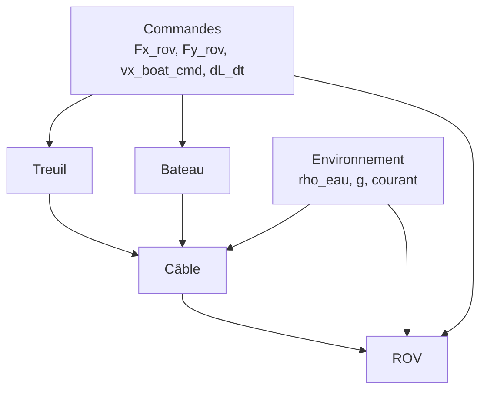

# Modélisation du système bateau–treuil–câble–ROV

## Table des matières

1. Repère et conventions
2. Variables d’état et commandes
3. Modèle ROV
4. Modèle Bateau
5. Modèle Câble
6. Conditions aux limites
7. Influence du treuil (dL/dt)
8. Profil de courant
9. Schéma des interactions

## 1. Repère et conventions

- Modèle 2D (x horizontal, y vertical).
- Convention de signe : y < 0 sous la surface, y = 0 à la surface.
- Le bateau est contraint à y = 0.
- Le câble et le ROV ne peuvent pas remonter au-dessus de la surface.

## 2. Variables d’état et commandes

### 2.1 Vecteur d’état

L’état global est défini par :

- ROV : position et vitesse (x_rov, y_rov, vx_rov, vy_rov)
- Bateau : position et vitesse (x_boat, vx_boat)
- Câble : positions nodales (x_cable, y_cable) et tensions nodales T
- Longueur de câble : L

Taille du vecteur d’état :

```
6 + 3*(N+1) + 1
```

où N est le nombre de segments du câble.

### 2.2 Commandes

Le vecteur de commande u(t) contient :

- Fx_rov : force horizontale sur le ROV (N)
- Fy_rov : force verticale sur le ROV (N)
- vx_boat_cmd : vitesse commandée du bateau (m/s)
- dL_dt : variation de la longueur de câble (m/s)

## 3. Modèle ROV

### 3.1 Traînée

Traînée quadratique selon la vitesse relative :

```
Fx_drag = -Cx * 0.5 * rho_eau * Sx * vx_rel * |vx_rel|
Fy_drag = -Cy * 0.5 * rho_eau * Sy * vy * |vy|
```

où :
- vx_rel = vx_rov - v_current(y_rov)
- Sx = a*h (section frontale horizontale)
- Sy = a*b (section frontale verticale)

### 3.2 Poids et poussée d’Archimède

```
F_weight = m * g
F_buoyancy = rho_eau * V * g
F_apparent_weight = F_weight - F_buoyancy
```

### 3.3 Équations de mouvement (ROV)

Avec la tension du câble appliquée selon l’angle local :

```
dvx_rov/dt = (Fx_drag + T0 * cos(theta0) + Fx_rov) / m
dvy_rov/dt = (F_apparent_weight + Fy_drag + T0 * sin(theta0) + Fy_rov) / m
```

La direction (cos(theta0), sin(theta0)) est calculée à partir du segment du câble
adjacent au ROV (orientation vers le bateau).

## 4. Modèle Bateau

Le bateau est modélisé avec une commande de vitesse et une force de propulsion
qui s’oppose à la traînée :

```
F_prop = k_prop * (v_cmd - v_current) - k_drag * v_current * |v_current|
dvx_boat/dt = F_prop / m_boat
```

Dans l’implémentation actuelle, l’effet de la tension du câble sur le bateau est
négligé pour le mouvement horizontal.

## 5. Modèle Câble

### 5.1 Discrétisation

Le câble est discrétisé en N segments, N+1 nœuds. Chaque nœud a des coordonnées
(x_i, y_i) et une tension T_i. La longueur totale est L.

### 5.2 Tension et géométrie

Deux régimes sont utilisés :

1) **Statique (caténaire)**
   - Si le câble est plus dense que l’eau : solution en caténaire
   - Si le câble est tendu (L < distance droite) : câble rectiligne

2) **Dynamique**
   - Résolution du profil de câble avec forces hydrodynamiques et poids apparent
   - Mise à jour des tensions via relaxation temporelle

### 5.3 Poids apparent du câble

```
weight_per_unit = (rho_cable - rho_eau) * A_cable * g
```

### 5.4 Forces hydrodynamiques (câble)

La traînée sur un segment est calculée par :

```
F_drag = Cx_cable * 0.5 * rho_eau * d * v_rel * |v_rel| * ds
```

La direction du courant est horizontale. Le poids apparent est appliqué verticalement.

## 6. Conditions aux limites

- Bateau : y = 0, position horizontale libre.
- ROV : y <= 0 (si y > 0, la vitesse verticale est corrigée).
- Câble : tous les points sont contraints à y <= 0.
- Longueur : normalisation pour imposer L.

## 7. Influence du treuil (dL/dt)

La longueur du câble est un état dynamique :

```
dL/dt = u["dL_dt"]
```

La valeur de L est transmise au solveur de câble à chaque itération.

## 8. Profil de courant

Le courant est défini par un profil en fonction de la profondeur (y) :

- Valeur constante
- Table profondeur/vitesse interpolée
- Chaîne formatée (ex: "0:0;10:0.5;50:1.0")

Le courant influe sur la traînée du ROV et du câble.

## 9. Schéma des interactions


