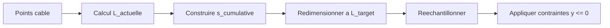

# Résolution numérique

## Table des matières

1. Intégration temporelle
2. Résolution couplée ROV–câble–bateau
3. Solveur de câble
4. Normalisation de la longueur du câble
5. Contraintes numériques et stabilité
6. Diagnostic et traces
7. Schéma de la boucle numérique
8. Schéma de normalisation de longueur

## 1. Intégration temporelle

Le système est intégré par la méthode de résolution d’EDO de SciPy
(`scipy.integrate.solve_ivp`). L’intégrateur est encapsulé dans
`TimeIntegrator` et utilise par défaut `RK45` (Runge–Kutta adaptatif d’ordre 4/5).

Paramètres principaux :

- `method` : RK45 (configurable)
- `rtol`, `atol` : tolérances de l’intégrateur
- `max_step` : pas de temps maximum (dt_max)

Le pas de temps effectif est adaptatif, mais contraint par `max_step`.

## 2. Résolution couplée ROV–câble–bateau

À chaque itération :

1. Dépaquetage du vecteur d’état.
2. Résolution de la géométrie du câble selon la longueur L et la configuration.
3. Calcul des forces hydrodynamiques et des tensions.
4. Calcul des dérivées pour le ROV, le bateau et la longueur du câble.
5. Retour au solveur d’EDO.

Le couplage est donc fort : la géométrie du câble dépend de l’état instantané,
et la tension influence directement la dynamique du ROV.

## 3. Solveur de câble

### 3.1 Statique (caténaire)

Lorsque le câble est plus dense que l’eau, la forme est calculée via une
caténaire :

```
y = a * cosh((x - x0) / a) + y0
```

Un solveur itératif ajuste les paramètres (a, x0, y0) pour satisfaire :

- les positions des extrémités
- la longueur totale L

Si le câble est tendu (L < distance droite), une solution rectiligne est utilisée.

### 3.2 Statique avec courant

Le courant est intégré par une approche itérative :

1. Initialisation par la caténaire.
2. Calcul des forces de traînée par segment.
3. Mise à jour de la géométrie (déplacements horizontaux).
4. Normalisation de la longueur.
5. Répétition jusqu’à convergence.

Une variante tente un solveur « complet » (fsolve) avant de se replier
sur l’algorithme itératif.

### 3.3 Dynamique

Le solveur dynamique calcule une configuration du câble en prenant en compte
les vitesses et les forces, puis applique une relaxation temporelle sur les
tensions :

```
dT/dt = (T_new - T) / tau_tension
```

Le temps de relaxation est ajusté pour améliorer la stabilité et la réponse
lorsque le ROV remonte alors qu’il devrait descendre.

## 4. Normalisation de la longueur du câble

La longueur L doit être respectée exactement, même après corrections de
géométrie (ex: contraintes de surface). La normalisation est réalisée par :

1. Calcul de la longueur curviligne actuelle par somme des segments.
2. Construction d’un abscisse curviligne cumulative `s_cumulative`.
3. Remise à l’échelle des distances :

```
s_cumulative *= L_target / L_actual
```

4. Rééchantillonnage des points à intervalles réguliers :

```
s_target = linspace(0, L_target, N+1)
```

5. Interpolation linéaire pour chaque nœud.
6. Réapplication des contraintes (y <= 0).

Cette normalisation garantit que la longueur simulée suit la consigne dL/dt,
au prix d’un léger lissage de la géométrie du câble.

## 5. Contraintes numériques et stabilité

Contraintes imposées à chaque étape :

- y_rov <= 0 et y_cable <= 0
- correction de points proches de la surface
- renormalisation si la longueur dévie

Limites principales :

- modèle fortement non linéaire (traînée quadratique, catenaires)
- sensibilité aux paramètres de courant et de longueur
- nécessité d’un pas de temps suffisamment petit en cas de variations rapides

## 6. Diagnostic et traces

Le système utilise `trace_print` avec niveaux de log pour faciliter
le diagnostic : forces, tensions, longueur, équilibre du câble.

Ces traces peuvent être activées via le niveau global de log.

## 7. Schéma de la boucle numérique

```mermaid
flowchart TD
    A[Etat y(t)] --> B[Decomposer et valider]
    B --> C[Resoudre cable (statique/dynamique)]
    C --> D[Calculer forces]
    D --> E[Derivees dy/dt]
    E --> F[solve_ivp / RK45]
    F --> A
```

## 8. Schéma de normalisation de longueur


