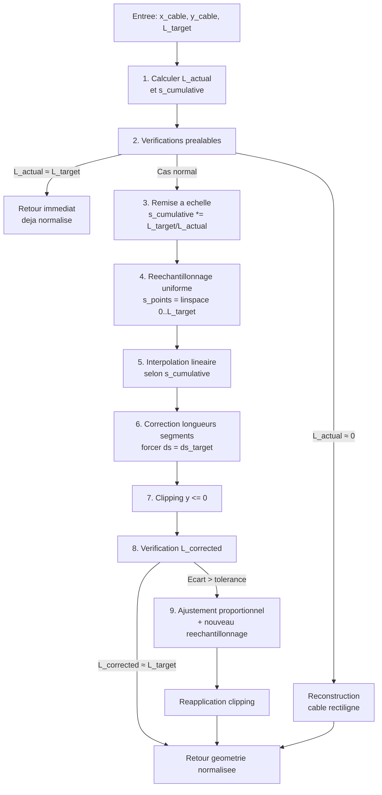
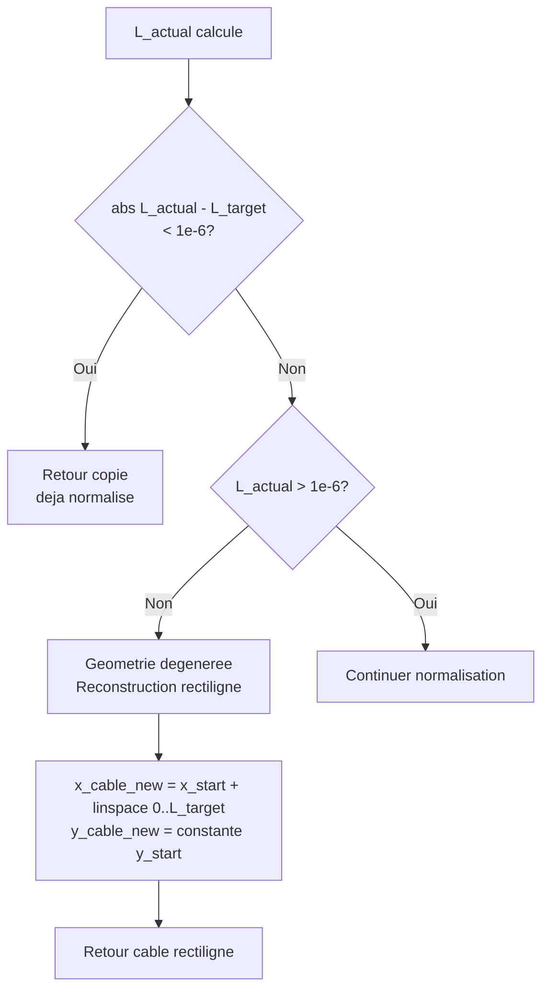
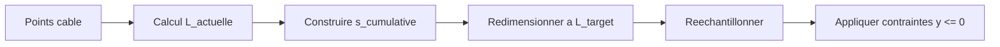

# Résolution numérique

## Table des matières

1. Intégration temporelle
1bis. Intégration contrainte (half-explicit, chantier DAE)
2. Résolution couplée ROV–câble–bateau
3. Workflow détaillé (pseudo-code)
4. Solveur de câble
5. Normalisation de la longueur du câble
   - 5.1 Contraintes critiques
   - 5.2 Algorithme de normalisation
   - 5.3 Schéma détaillé étape par étape
6. Contraintes numériques et stabilité
7. Diagnostic et traces
8. Schéma de la boucle numérique
9. Schéma de normalisation de longueur

## 1. Intégration temporelle

Le système est intégré par la méthode de résolution d’EDO de SciPy
(`scipy.integrate.solve_ivp`). L’intégrateur est encapsulé dans
`TimeIntegrator` et utilise par défaut `RK45` (Runge–Kutta adaptatif d’ordre 4/5).
L’appel à l’intégrateur se fait dans `SystemModel.integrate()`, qui fournit au
solveur la fonction d’EDO `system_ode(t, y)`. À chaque pas, `system_ode` appelle
`u_func(t)` (commande) puis `compute_derivatives(t, y, u)` (dérivées).

Paramètres principaux :

- `method` : RK45 (configurable)
- `rtol`, `atol` : tolérances de l’intégrateur
- `max_step` : pas de temps maximum (dt_max)

Le pas de temps effectif est adaptatif, mais contraint par `max_step`.

### 1bis. Intégration contrainte (half-explicit, chantier DAE)

En complément du schéma ODE ci-dessus, une option **`use_constrained_integrator`**
(paramètre de calcul / interface « Intégration contrainte ») active une intégration
**half-explicit** sur chaque intervalle `[t, t+\Delta t]` de la boucle simulation :

- plusieurs **sous-pas RK4** (`dae_projection_substeps`, défaut 4) ;
- après **chaque** sous-pas, **projection** du câble via `_normalize_cable_length` et
  recalcul des tensions (`project_cable_state_inplace` dans
  `src/models/state_projection.py`).

Objectif : réduire les incohérences entre la longueur scalaire `L` et la longueur
curviligne discrète \(\sum \| \Delta P_i \|\), et limiter les géométries aberrantes
pendant l’intégration. Ce n’est pas encore un DAE formel avec matrice de masse
singulière ; la spécification et les évolutions possibles sont décrites dans
[`dae_cable_rov_spec.md`](dae_cable_rov_spec.md).

Fichiers principaux : `src/solvers/projected_integrator.py`,
`src/models/state_projection.py`, `ROVSystem.integrate_span_with_projection`,
branche correspondante dans `simulation_thread.py`.

## 2. Résolution couplée ROV–câble–bateau

À chaque itération (pas d’intégration) :

1. L’intégrateur appelle `system_ode(t, y)`.
2. La commande est évaluée via `u_func(t)` (incluant `dL_dt`).
3. Dépaquetage du vecteur d’état `y` (incluant la longueur courante `L`).
4. Résolution de la géométrie du câble selon `L` et la configuration.
5. Calcul des forces hydrodynamiques et des tensions.
6. Calcul des dérivées pour le ROV, le bateau et la longueur du câble.
7. Retour des dérivées au solveur d’EDO, qui met à jour l’état.

Le couplage est donc fort : la géométrie du câble dépend de l’état instantané,
et la tension influence directement la dynamique du ROV.
La commande `dL_dt` est prise en compte dans `compute_derivatives` via
`dydt[idx_L] = u['dL_dt']`. L’évolution de `L` est donc effectuée par
l’intégrateur (pas d’équation explicite `L = L + dL_dt * dt` dans le code).

## 3. Workflow détaillé (pseudo-code)

Le pseudo-code ci-dessous explicite l’ordre d’exécution, en mettant en évidence
la résolution statique initiale, l’appel à l’ODE, la prise en compte du courant,
et les normalisations de longueur.

```
integrate(t_span, y0, u_func, dt_max):
    integrator.max_step = dt_max
    define system_ode(t, y):
        u = u_func(t)  # inclut dL_dt (commande moulinet)
        return compute_derivatives(t, y, u)
    return integrator.integrate(system_ode, t_span, y0)

compute_derivatives(t, y, u):
    # 1) Dépaquetage et contrôles
    (x_rov, y_rov, vx_rov, vy_rov, x_boat, vx_boat,
     x_cable, y_cable, T, L) = unpack_state(y)

    # 2) Résolution de la géométrie du câble
    if first_iteration:
        (x_cable_new, y_cable_new, T_new) = solve_equilibrium_static(..., L)
    else:
        # solve_equilibrium prend en compte la dynamique et le courant
        (x_cable_new, y_cable_new, T_new) = solve_equilibrium(..., L, courant)

    # 3) Contraintes géométriques (surface) + normalisation post-clipping
    y_cable_new = clip(y_cable_new, y <= 0)
    if length_changed_by_clipping:
        (x_cable_new, y_cable_new) = normalize_length(..., L)
        y_cable_new = clip(y_cable_new, y <= 0)

    # 4) Calculs de forces et tensions, puis dérivées d’état
    dL_dt = u['dL_dt']  # prise en compte directe de la commande
    dydt = assemble_derivatives(..., dL_dt, x_cable_new, y_cable_new, T_new)
    return dydt

solve_equilibrium(..., L, courant):
    # Configuration dynamique du câble
    if courant != 0:
        # itérations: forces de traînée -> mise à jour géométrie
        # normalisation de longueur à chaque itération si nécessaire
        normalize_length(..., L)
    return x_cable, y_cable, T
```

## 4. Solveur de câble

### 3.1 Statique (caténaire)

Lorsque le câble est plus dense que l’eau, la forme de référence est calculée via
une caténaire :

```
y = a * cosh((x - x0) / a) + y0
```

Un solveur itératif ajuste les paramètres (a, x0, y0) pour satisfaire :

- les positions des extrémités
- la longueur totale L

Deux cas particuliers sont ensuite gérés finement dans `CableSolver.solve_equilibrium_static` :

- **cas câble plus court que la distance droite** (`L < L_straight`) : la géométrie
  est **forcée rectiligne** entre bateau et ROV, puis la longueur est renormalisée
  pour respecter exactement `L`, et les tensions d’extrémité sont obtenues en
  résolvant un petit système d’équilibre global (avec repli sur une projection
  des forces si la matrice est quasi singulière) ;
- **cas câble légèrement plus long que la distance droite** (`r = L / L_straight`
  proche de 1) : le solveur calcule **à la fois** une caténaire et une ligne droite,
  puis effectue un **blending continu** entre les deux géométries en fonction de r.
  Pour `r = 1`, la solution est 100 % rectiligne ; pour `r ≥ 1.01`, la solution est
  100 % caténaire ; entre les deux, la transition est linéaire.  

Ce blending continu remplace l’ancien basculement binaire (hystérésis) et supprime
les discontinuités numériques lorsque le câble passe progressivement d’un régime
quasi-tendu à un régime nettement fléchi. Après le blending, la longueur est
de nouveau renormalisée (`_normalize_cable_length`) pour garantir `Σ ds = L` et
des segments de longueur identique.

### 3.2 Statique avec courant

Le courant est intégré par une approche itérative :

1. Initialisation par la caténaire.
2. Calcul des forces de traînée par segment.
3. Mise à jour de la géométrie (déplacements horizontaux).
4. Normalisation de la longueur.
5. Répétition jusqu’à convergence.

Une variante tente un solveur « complet » (fsolve) avant de se replier
sur l’algorithme itératif.  

Afin de préserver la forme de caténaire lorsque le courant est **faible**, le
solveur commence par évaluer l’ordre de grandeur des forces de traînée par
rapport au poids apparent du câble :

- si le **rapport traînée/poids** reste inférieur à un seuil (≈ 10 %), l’algorithme
  **saute les itérations** et conserve la géométrie de caténaire initiale ;
- si ce rapport devient significatif, l’itération complète est activée jusqu’à
  convergence, avec renormalisations intermédiaires de longueur.

### 3.3 Dynamique

Le solveur dynamique calcule une configuration du câble en prenant en compte
les vitesses et les forces, puis applique une relaxation temporelle sur les
tensions :

```
dT/dt = (T_new - T) / tau_tension
```

Le temps de relaxation est ajusté pour améliorer la stabilité et la réponse
lorsque le ROV remonte alors qu’il devrait descendre.

## 5. Normalisation de la longueur du câble

### 5.1 Contraintes critiques

La longueur `L(t)` est **fixe** et déterminée par `L(0) + somme des dL/dt`. Elle ne doit **jamais** être ajustée en cours d'itération.

À la fin de chaque itération, les contraintes suivantes doivent être respectées :

1. **Longueur exacte** : La longueur totale du câble doit être exactement égale à `L(t)`.

2. **Segments de longueur égale** : Tous les N segments doivent avoir la même longueur `ds = L(t) / N`.

3. **Abscisse curviligne** : Le point de contact du câble et du ROV doit avoir une abscisse curviligne `s = L(t)`.

4. **Slack >= 0** : Le slack (`L(t) - D_straight`) doit toujours être >= 0. Si le slack devient négatif, la tension au ROV est ajustée pour ramener le slack à >= 0.

### 5.2 Algorithme de normalisation

La normalisation est réalisée dans le solveur de câble (`_normalize_cable_length`) et, si nécessaire, réappliquée après clipping de surface dans `SystemModel.compute_derivatives`.

Les étapes principales sont :

1. **Calcul de la longueur curviligne actuelle** par somme des segments.

2. **Construction d'un abscisse curviligne cumulative** `s_cumulative`.

3. **Remise à l'échelle des distances** :

```
s_cumulative *= L_target / L_actual
```

4. **Rééchantillonnage des points à intervalles réguliers** pour garantir des segments de longueur égale :

```
s_target = linspace(0, L_target, N+1)  # Points à s = 0, ds, 2*ds, ..., L
ds = L_target / N  # Longueur de chaque segment
```

5. **Interpolation linéaire** pour chaque nœud selon l'abscisse curviligne.

6. **Réapplication des contraintes** :
   - Extrémités : premier point au bateau (s=0), dernier point au ROV (s=L)
   - Contrainte de surface (y <= 0)
   - Vérification finale de la longueur totale

7. **Ajustement proportionnel** si nécessaire pour garantir la longueur exacte.

Cette normalisation garantit que :
- La longueur simulée suit exactement la consigne `dL_dt`
- Tous les segments ont la même longueur
- Le dernier point correspond au ROV avec `s = L(t)`

#### Détail algorithmique

L'algorithme utilisé dans `_normalize_cable_length` peut se résumer ainsi :

1. On part d'une géométrie de câble déjà calculée par le solveur statique ou dynamique.
2. On calcule l'abscisse curviligne cumulée du câble actuel.
3. On remet cette abscisse à l'échelle pour que son dernier point vaille exactement `L_target`.
4. On définit une nouvelle discrétisation uniforme `s_i = i * L_target / N` pour `i = 0..N`.
5. On interpole la géométrie initiale sur cette nouvelle discrétisation uniforme.
6. On corrige ensuite explicitement chaque segment pour que sa longueur géométrique soit exactement `ds = L_target / N`, en propageant les points depuis le point 0.
7. On réapplique les contraintes physiques simples, en particulier `y <= 0`.
8. Si des erreurs d'arrondi subsistent sur la longueur totale, on applique un léger redimensionnement global puis un nouveau rééchantillonnage uniforme.

Autrement dit, la fonction de normalisation ne cherche pas seulement à "étirer" ou "contracter" le câble globalement. Elle reconstruit une géométrie discrète cohérente avec les trois contraintes numériques principales :

- longueur totale égale à `L_target`,
- N segments de même longueur,
- paramétrisation curviligne compatible avec `s = 0 ... L_target`.

#### Tensions après renormalisation

La renormalisation ne recalcule pas elle-même les tensions. La fonction `_normalize_cable_length` ne manipule que la géométrie (`x_cable`, `y_cable`).

Le recalcul des tensions est fait ensuite, par le solveur, sur la géométrie finale renormalisée :

- dans la résolution statique ou pseudo-statique, une fois la géométrie convergée et renormalisée, le solveur recalcule les efforts répartis sur les segments ;
- à partir de ces efforts et des directions des segments aux extrémités, il résout l'équilibre global pour retrouver les tensions d'extrémité ;
- il reconstruit ensuite le profil de tension le long du câble, ou utilise `compute_tensions(...)` en repli si nécessaire.

Il est important de noter qu'il n'y a pas forcément un recalcul complet des tensions après chaque appel intermédiaire à `_normalize_cable_length` à l'intérieur des boucles internes. En pratique, la géométrie peut être renormalisée plusieurs fois au cours d'une itération du solveur, mais le recalcul de la tension utile est effectué sur la géométrie finale retenue en sortie du solveur.

Enfin, dans `ROVSystem.compute_derivatives`, les tensions renvoyées par le solveur (`T_new`) ne remplacent pas instantanément l'état dynamique `T`. Elles servent de cible de relaxation :

```python
dT_dt = (T_new - T) / tau_tension
```

Donc :

- après renormalisation, la géométrie est corrigée immédiatement ;
- les tensions du solveur sont recalculées sur cette géométrie corrigée ;
- mais les tensions stockées dans l'état intégré évoluent en général progressivement vers cette nouvelle cible ;
- seule la tension au ROV peut être forcée à s'adapter beaucoup plus vite lorsque le slack devient négatif.

#### Schéma de séquence : géométrie puis tensions

```mermaid
flowchart TD
    A[Geometrie brute calculee<br/>par le solveur] --> B[Forcage des extremites<br/>bateau et ROV]
    B --> C[Normalisation curviligne<br/>_normalize_cable_length]
    C --> D[Clipping surface<br/>y <= 0]
    D --> E[Renormalisation si le clipping<br/>a modifie la longueur]
    E --> F[Geometrie finale retenue]
    F --> G[Recalcul des forces reparties<br/>sur le cable]
    G --> H[Recalcul des tensions du solveur<br/>T_new]
    H --> I[Mise a jour dynamique<br/>dT_dt = (T_new - T) / tau]
    I --> J[Tension effectivement integree<br/>dans l etat]
    H --> K[Cas critique slack < 0<br/>adaptation plus rapide au ROV]
    K --> I
```

Lecture du schéma :

- les blocs `B` a `F` concernent uniquement la géométrie ;
- les blocs `G` et `H` utilisent cette géométrie finale pour reconstruire un champ de tensions cohérent ;
- le bloc `I` rappelle que, dans le système dynamique, les tensions calculées par le solveur ne sont généralement pas appliquées instantanément ;
- en cas de `slack < 0`, la composante de tension au niveau du ROV est accélérée pour faire respecter plus vite la contrainte physique.

### 5.3 Schéma détaillé étape par étape

Cette section décrit en détail l'algorithme implémenté dans `_normalize_cable_length` (référence : `src/solvers/cable_solver.py`, lignes 1841-2049).

#### Vue d'ensemble du flux principal



#### Étape 1 : Calcul de la longueur actuelle et abscisse curviligne cumulative

**Référence code** : lignes 1858-1868

```python
N = len(x_cable) - 1
s_cumulative = np.zeros(N + 1)
for i in range(N):
    dx = x_cable[i+1] - x_cable[i]
    dy = y_cable[i+1] - y_cable[i]
    ds = np.sqrt(dx**2 + dy**2)
    s_cumulative[i+1] = s_cumulative[i] + ds
L_actual = s_cumulative[-1]
```

**Objectif** : Calculer la longueur totale réelle du câble (`L_actual`) et construire l'abscisse curviligne cumulative `s_cumulative` où `s_cumulative[i]` représente la distance curviligne depuis le point 0 jusqu'au point `i`.

**Résultat** :
- `L_actual` : longueur totale actuelle du câble
- `s_cumulative` : tableau de taille `N+1` avec `s_cumulative[0] = 0` et `s_cumulative[-1] = L_actual`

#### Étape 2 : Vérifications préalables

**Référence code** : lignes 1870-1885



**Cas 1 : Déjà normalisé**
- Si `|L_actual - L_target| < 1e-6`, retourner une copie de `x_cable` et `y_cable` sans modification.

**Cas 2 : Géométrie dégénérée (`L_actual ≈ 0`)**
- Si `L_actual <= 1e-6`, reconstruire un câble rectiligne horizontal :
  ```python
  x_cable_new = x_start + np.linspace(0.0, L_target, N + 1)
  y_cable_new = np.full(N + 1, y_start, dtype=float)
  ```
- Les extrémités seront refixées ultérieurement par `system_model.py`.

#### Étape 3 : Remise à l'échelle de l'abscisse curviligne

**Référence code** : lignes 1874-1876

```python
s_cumulative = s_cumulative * (L_target / L_actual)
```

**Objectif** : Remettre à l'échelle `s_cumulative` pour que `s_cumulative[-1] = L_target` exactement.

**Effet** : Tous les points sont "étirés" ou "contractés" proportionnellement selon leur position curviligne, garantissant que le dernier point corresponde à `s = L_target`.

**Remarque importante** : cette remise à l’échelle est appliquée **même si** `L_actual` est déjà très proche de `L_target`. Il n’y a plus de retour anticipé dans ce cas : on reparamétrise systématiquement la courbe en abscisse curviligne avant le rééchantillonnage, afin de régulariser entièrement les longueurs de segments.

#### Étape 4 : Rééchantillonnage uniforme

**Référence code** : lignes 1890-1894

```python
ds_target = L_target / max(N, 1)
s_points = np.linspace(0.0, L_target, N + 1)
```

**Objectif** : Définir une nouvelle discrétisation uniforme avec des points espacés régulièrement en abscisse curviligne.

**Résultat** :
- `ds_target` : longueur cible de chaque segment (`ds_target = L_target / N`)
- `s_points` : tableau `[0, ds_target, 2*ds_target, ..., L_target]` de taille `N+1`

#### Étape 5 : Interpolation linéaire selon l'abscisse curviligne

**Référence code** : lignes 1896-1923

```mermaid
flowchart LR
    A[s_points uniformes<br/>0, ds, 2ds, ..., L_target] --> B[Pour chaque s_i]
    B --> C[Recherche binaire<br/>dans s_cumulative]
    C --> D{Trouve segment<br/>j tel que<br/>s_cumulative[j-1] <= s_i<br/>< s_cumulative[j]?}
    D -->|Oui| E[Interpolation lineaire<br/>alpha = s_i - s_prev / s_next - s_prev<br/>x = x[j-1] + alpha * dx<br/>y = y[j-1] + alpha * dy]
    D -->|s_i trop proche| F[Point identique]
    E --> G[Point interpole ajoute]
    F --> G
    G --> H{Autres points?}
    H -->|Oui| B
    H -->|Non| I[Geometrie interpolee complete]
```

**Algorithme** :
Pour chaque `s_i` dans `s_points` :

1. **Recherche du segment contenant `s_i`** :
   ```python
   idx = np.searchsorted(s_cumulative, s_i)
   if idx == 0: idx = 1
   elif idx >= len(s_cumulative): idx = len(s_cumulative) - 1
   ```

2. **Interpolation linéaire** :
   ```python
   s_prev = s_cumulative[idx - 1]
   s_next = s_cumulative[idx]
   if abs(s_next - s_prev) > 1e-6:
       alpha = (s_i - s_prev) / (s_next - s_prev)
       x_cable_final[i] = x_cable[idx - 1] + alpha * (x_cable[idx] - x_cable[idx - 1])
       y_cable_final[i] = y_cable[idx - 1] + alpha * (y_cable[idx] - y_cable[idx - 1])
   ```

**Résultat** : Géométrie interpolée `x_cable_final`, `y_cable_final` avec la forme générale du câble original mais avec des points espacés uniformément en abscisse curviligne.

#### Étape 6 : Correction des longueurs de segments

**Référence code** : lignes 1928-1966

```mermaid
flowchart TD
    A[Geometrie interpolee] --> B[Point 0: position fixee]
    B --> C[Pour i = 0..N-1]
    C --> D[Calcul direction segment<br/>dx = x_final[i+1] - x_final[i]<br/>dy = y_final[i+1] - y_final[i]]
    D --> E{ds_current > 1e-9?}
    E -->|Oui| F[Normaliser direction<br/>et multiplier par ds_target<br/>x_corrected[i+1] = x_corrected[i] + dx_norm * ds_target]
    E -->|Non| G{Segment precedent<br/>disponible?}
    G -->|Oui| H[Utiliser direction precedente]
    G -->|Non| I[Direction par defaut<br/>horizontale]
    F --> J[Point i+1 positionne]
    H --> J
    I --> J
    J --> K{i < N-1?}
    K -->|Oui| C
    K -->|Non| L[Tous segments corriges<br/>ds = ds_target exactement]
```

**Objectif critique** : Garantir que **chaque segment a exactement la longueur `ds_target`**, pas seulement une approximation.

**Algorithme de propagation** :
```python
x_cable_corrected[0] = x_cable_final[0]
y_cable_corrected[0] = y_cable_final[0]

for i in range(N):
    dx = x_cable_final[i+1] - x_cable_final[i]
    dy = y_cable_final[i+1] - y_cable_final[i]
    ds_current = np.sqrt(dx**2 + dy**2)
    
    if ds_current > 1e-9:
        # Normaliser la direction et multiplier par ds_target
        x_cable_corrected[i+1] = x_cable_corrected[i] + (dx / ds_current) * ds_target
        y_cable_corrected[i+1] = y_cable_corrected[i] + (dy / ds_current) * ds_target
    else:
        # Cas dégénéré : utiliser direction précédente ou horizontale
        # ...
```

**Résultat** : Géométrie `x_cable_corrected`, `y_cable_corrected` où chaque segment a **exactement** `ds_target` de longueur, garantissant `L_corrected = N * ds_target = L_target`.

#### Étape 7 : Application des contraintes physiques

**Référence code** : lignes 1926, 1968-1969

```python
y_cable_corrected = np.clip(y_cable_corrected, None, 0.0)
```

**Contrainte** : Le câble ne peut pas être au-dessus de la surface (`y <= 0`).

**Effet** : Tous les points avec `y > 0` sont ramenés à `y = 0`.

#### Étape 8 : Vérification et ajustement final

**Référence code** : lignes 1971-2047

```mermaid
flowchart TD
    A[Geometrie corrigee] --> B[Calcul L_corrected<br/>somme des segments]
    B --> C{abs L_corrected - L_target<br/>/ L_target > 1e-6?}
    C -->|Non| D[Geometrie finale valide]
    C -->|Oui| E[Ajustement proportionnel<br/>scale = L_target / L_corrected]
    E --> F[Redimensionner depuis point 0<br/>x_new[i] = x_base + dx * scale<br/>y_new[i] = y_base + dy * scale]
    F --> G[Reapplication clipping y <= 0]
    G --> H[Nouveau reechantillonnage uniforme<br/>avec correction longueurs]
    H --> I[Geometrie finale valide]
```

**Vérification** :
```python
L_corrected = 0.0
for i in range(N):
    dx = x_cable_corrected[i+1] - x_cable_corrected[i]
    dy = y_cable_corrected[i+1] - y_cable_corrected[i]
    L_corrected += np.sqrt(dx**2 + dy**2)
```

**Si écart détecté** (`|L_corrected - L_target| / L_target > 1e-6`) :

1. **Ajustement proportionnel** :
   ```python
   scale = L_target / L_corrected
   x_base = x_cable_corrected[0]
   y_base = y_cable_corrected[0]
   for i in range(1, N + 1):
       dx = x_cable_corrected[i] - x_base
       dy = y_cable_corrected[i] - y_base
       x_cable_corrected[i] = x_base + dx * scale
       y_cable_corrected[i] = y_base + dy * scale
   ```

2. **Réapplication du clipping** : `y_cable_corrected = np.clip(y_cable_corrected, None, 0.0)`

3. **Nouveau rééchantillonnage uniforme** : Répéter les étapes 4-6 pour garantir des segments de longueur exacte après l'ajustement.

**Résultat final** : Géométrie normalisée avec :
- Longueur totale exactement égale à `L_target`
- Tous les segments de longueur exactement égale à `ds_target = L_target / N`
- Contrainte `y <= 0` respectée
- Forme générale du câble original préservée

#### Exemple numérique

**Entrée** :
- `x_cable = [0.0, 1.0, 2.5, 4.0, 5.0]`
- `y_cable = [0.0, -1.0, -2.0, -1.5, -2.0]`
- `L_target = 6.0`
- `N = 4` (5 points, 4 segments)

**Étape 1** : Calcul de `L_actual`
- Segment 0-1 : `ds = √((1-0)² + (-1-0)²) = √2 ≈ 1.414`
- Segment 1-2 : `ds = √((2.5-1)² + (-2-(-1))²) = √(2.25+1) ≈ 1.803`
- Segment 2-3 : `ds = √((4-2.5)² + (-1.5-(-2))²) = √(2.25+0.25) ≈ 1.581`
- Segment 3-4 : `ds = √((5-4)² + (-2-(-1.5))²) = √(1+0.25) ≈ 1.118`
- `L_actual ≈ 5.916`
- `s_cumulative = [0.0, 1.414, 3.217, 4.798, 5.916]`

**Étape 3** : Remise à l'échelle
- `scale = 6.0 / 5.916 ≈ 1.014`
- `s_cumulative = [0.0, 1.434, 3.262, 4.867, 6.0]`

**Étape 4** : Rééchantillonnage uniforme
- `ds_target = 6.0 / 4 = 1.5`
- `s_points = [0.0, 1.5, 3.0, 4.5, 6.0]`

**Étape 5** : Interpolation
- Pour `s_i = 1.5` : trouve dans segment 0-1, `alpha ≈ 0.061`, interpolation → `(x, y) ≈ (0.061, -0.061)`
- Pour `s_i = 3.0` : trouve dans segment 1-2, interpolation → `(x, y) ≈ (2.0, -1.5)`
- Pour `s_i = 4.5` : trouve dans segment 2-3, interpolation → `(x, y) ≈ (3.5, -1.75)`
- Points extrêmes : `(0, 0)` et `(5, -2)` conservés

**Étape 6** : Correction des longueurs
- Propagation depuis point 0 avec `ds_target = 1.5` exactement pour chaque segment

**Résultat** :
- Longueur totale : exactement `6.0`
- Longueur de chaque segment : exactement `1.5`
- Forme générale préservée

## 6. Contraintes numériques et stabilité

### 6.1 Contraintes physiques

Contraintes imposées à chaque étape :

- **Surface** : `y_rov <= 0` et `y_cable <= 0`
- **Correction de points proches de la surface** : points à moins de 1 cm de la surface sont déplacés
- **Longueur exacte** : renormalisation systématique pour garantir `L(t) = L(0) + somme des dL/dt`
- **Segments de longueur égale** : rééchantillonnage pour garantir `ds = L(t) / N` pour tous les segments
- **Extrémités** : premier point au bateau (s=0), dernier point au ROV (s=L(t))

### 6.2 Contrainte de slack

**Contrainte critique** : Le slack (`L(t) - D_straight`) doit toujours être >= 0.

Si le slack devient négatif :
1. La tension au ROV (`T_rov_target`) est augmentée proportionnellement au déficit de slack
2. La tension est utilisée directement dans les équations du mouvement (pas de délai d'adaptation)
3. Le taux de changement de tension (`dT_dt[-1]`) est forcé à une adaptation très rapide
4. La force de tension tire le ROV vers le bateau pour réduire `D_straight` et ramener slack >= 0

Cette contrainte garantit que le câble ne peut jamais être "tendu" au-delà de sa longueur physique.

Limites principales :

- modèle fortement non linéaire (traînée quadratique, catenaires)
- sensibilité aux paramètres de courant et de longueur
- nécessité d’un pas de temps suffisamment petit en cas de variations rapides

## 7. Diagnostic et traces

Le système utilise `trace_print` avec niveaux de log pour faciliter
le diagnostic : forces, tensions, longueur, équilibre du câble.

Ces traces peuvent être activées via le niveau global de log.

### 7.1 Séquence détaillée d'une itération dans SimulationThread

La boucle de simulation dans `SimulationThread.run()` suit la séquence suivante pour chaque itération :

#### Étape 1 : Extraction de l'état actuel (AVANT intégration)
- **Ligne ~435** : Extraction de `L_current` depuis `y_current` (état de l'itération précédente, après intégration)
  ```python
  (x_rov_current, y_rov_current, ..., L_current) = system.unpack_state(y_current)
  ```
- **Valeur de L utilisée** : `L_current` = valeur de L **après l'intégration de l'itération précédente**

#### Étape 2 : Calcul de la commande (AVANT intégration)
- **Ligne ~518-534** : Appel à `auto_L_7()` ou `commande_scenario()` avec `L_current`
  ```python
  auto_result = auto_func(t_current, y_rov_current, L_current, ...)
  ```
- **Messages trace IC_L_7** : Affichés **IMMÉDIATEMENT** avec la valeur `curr['L']` (qui correspond à `L_current` passée en paramètre)
  - Ces traces montrent la valeur de L **utilisée pour calculer la commande**
  - Format : `IC_L_7: t=36.30, L=72.43, L_straight=70.90, slack=1.53, ...`

#### Étape 3 : Intégration temporelle
- **Ligne ~612-728** : Intégration d'un pas de temps de `t_current` à `t_next`
  - L'intégrateur calcule le nouvel état `y_current` (incluant le nouveau `L`)
  - `L` évolue selon `dL_dt` : `L(t+dt) = L(t) + dL_dt * dt`

#### Étape 4 : Extraction de l'état après intégration
- **Ligne ~732** : Extraction de `L` depuis `y_current` (état après intégration)
  ```python
  (x_rov, y_rov, ..., L) = system.unpack_state(y_current)
  ```
- **Valeur de L obtenue** : `L` = valeur de L **après l'intégration de l'itération actuelle**

#### Étape 5 : Stockage des données
- **Ligne ~836** : Stockage de `L` dans `data['L']`
  ```python
  data['L'].append(float(L))
  ```
- **Ligne ~837** : Calcul et stockage de `L_seg` (somme des longueurs des segments)
  ```python
  data['L_seg'].append(float(L_seg))
  ```

#### Étape 6 : Préparation des données pour l'UI
- **Ligne ~1116** : Stockage de `L` dans `L_step` pour l'affichage
  ```python
  update_data = {
      'current_time': t_current,
      'L_step': float(L),  # L après intégration
  }
  ```

#### Étape 7 : Émission des données à l'UI
- **Ligne ~1177** : Émission des données via `simulation_updated.emit(update_data)`
- **Affichage dans l'interface graphique** :
  - **"Long. câble commande"** : Affiche `L_step` = valeur de L **après intégration de l'itération actuelle**
  - **"Long. câble segments"** : Affiche `L_seg` = somme des longueurs des segments **après intégration**
  - **"Long. droite"** : Affiche `D_straight` = distance droite bateau-ROV **après intégration**

### 7.2 Décalage temporel entre traces et interface

**Important** : Il existe un décalage temporel d'une itération entre :
- **Messages trace IC_L_7** : Affichent `L` **utilisée pour calculer la commande** (avant intégration de l'itération actuelle)
- **Interface graphique** : Affiche `L_step` **après intégration de l'itération actuelle**

**Ordre de grandeur attendu du décalage** :
Si `dL_dt` est encadré (par exemple entre -1 et +1 m/s) et si le pas de temps `dt` est de l'ordre de 0.1 s, alors le changement maximal de L par itération serait de l'ordre de ±0.1 m. Un décalage de quelques centimètres à quelques dizaines de centimètres est donc normal.

**Attention** : Si un écart beaucoup plus important (plusieurs mètres) est observé entre les traces et l'interface, cela peut indiquer :
1. **Problème de synchronisation** : Les valeurs affichées ne correspondent pas au même instant `t`
2. **Problème de calcul** : Une erreur dans le calcul ou l'affichage de `L_step`
3. **Problème de stockage** : Une confusion entre différentes valeurs de L dans le code

**Exemple typique** :
- À `t = 36.30 s` :
  - **Trace IC_L_7** : `L=72.43 m` (valeur utilisée pour calculer `dL_dt` à `t=36.30 s`)
  - **Interface** : `L_step=72.35 m` (valeur de L après intégration de `t=36.30 s` à `t=36.30+dt s`)
  - **Décalage attendu** : Quelques centimètres (selon `dL_dt * dt`)

**Pourquoi ce décalage ?**
1. La commande `dL_dt` est calculée **avant** l'intégration avec la valeur de L disponible à ce moment
2. L'intégration met à jour L selon `L(t+dt) = L(t) + dL_dt * dt`
3. L'interface affiche la valeur **après** l'intégration
4. Les traces affichent la valeur **utilisée pour la commande** (cohérente avec le calcul)

**Cohérence** : Les traces `IC_L_7` utilisent maintenant `curr['L']` qui correspond exactement à la valeur de `L` passée en paramètre à `auto_L_7()`, garantissant la cohérence entre la valeur affichée dans les traces et celle utilisée pour le calcul de la commande.

## 8. Schéma de la boucle numérique

### 8.1 Schéma simplifié (niveau solveur)

```mermaid
flowchart TD
    A[Etat y(t)] --> B[system_ode(t,y)]
    B --> C[u_func(t) -> commande (dL_dt)]
    C --> D[Decomposer et valider]
    D --> E[Resoudre cable (statique/dynamique)]
    E --> F[Calculer forces]
    F --> G[Derivees dy/dt (incl. dL/dt)]
    G --> H[solve_ivp / RK45]
    H --> A
```

### 8.2 Schéma détaillé avec affichage (niveau SimulationThread)

```mermaid
flowchart TD
    A[Etat y_current<br/>L = L_après_prev_iter] --> B[Extraction L_current<br/>AVANT intégration]
    B --> C[Calcul commande auto_L_7<br/>avec L_current]
    C --> D[TRACE IC_L_7<br/>Affiche curr['L'] = L_current]
    D --> E[Intégration temporelle<br/>t_current -> t_next]
    E --> F[Extraction L<br/>APRÈS intégration]
    F --> G[Stockage data['L']<br/>et calcul L_seg]
    G --> H[Stockage L_step = L<br/>pour UI]
    H --> I[Émission à UI<br/>simulation_updated.emit]
    I --> J[Affichage interface<br/>L_step, L_seg, D_straight]
    J --> K[t_current = t_next]
    K --> A
    
    style D fill:#ffcccc
    style J fill:#ccffcc
```

**Légende** :
- **Rouge** : Messages trace (affichés avant intégration)
- **Vert** : Interface graphique (affichée après intégration)

## 9. Schéma de normalisation de longueur


