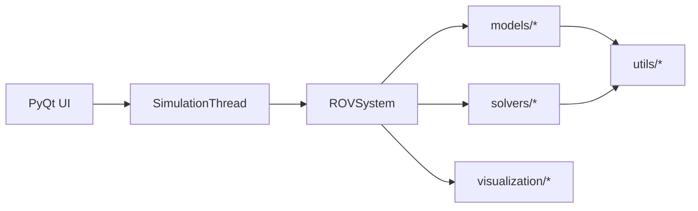

# Implémentation

## Table des matières

1. Architecture générale
2. Organisation des fichiers
3. Modèles physiques (src/models)
4. Solveurs (src/solvers)
5. Utilitaires (src/utils)
6. Interface PyQt (src/ui)
7. Missions et configuration
8. Tests
9. Extensibilité et maintenance
10. Schéma d’architecture logicielle

## 1. Architecture générale

Le projet est organisé en quatre couches principales :

1. **Modèles physiques** (`src/models`)
2. **Solveurs numériques** (`src/solvers`)
3. **Utilitaires et paramètres** (`src/utils`)
4. **Interface et visualisation** (`src/ui`, `src/visualization`)

Le point d’entrée utilisateur est l’application PyQt. Le cœur de la simulation
est le modèle `ROVSystem` qui couple ROV, câble et bateau.

## 2. Organisation des fichiers

```
src/
  models/           # ROV, câble, bateau, environnement, système complet
  solvers/          # Intégrateur temporel, solveur câble, forces
  utils/            # Paramètres, conditions initiales, scénarios, logs
  visualization/    # Fonctions Plotly (profils, tensions, commandes)
  ui/               # Interface PyQt (widgets, thread, état)
```

Autres répertoires :

- `Missions/` : missions (Param_mission.json + traces)
- `tests/` : tests unitaires
- `results/` : résultats exportés

## 3. Modèles physiques (src/models)

### 3.1 ROV

`rov_model.py` définit :

- paramètres géométriques (a, b, h) et masse m
- volume (vol) ou calcul automatique a*b*h
- coefficients de traînée (Cx, Cy)
- fonctions de force : traînée, poids, poussée d’Archimède

### 3.2 Câble

`cable_model.py` :

- paramètres du câble (diamètre, masse volumique, Cx_cable)
- liaison avec `CableSolver`
- choix statique/dynamique selon la disponibilité d’un état précédent

### 3.3 Bateau

`boat_model.py` :

- force de propulsion simple basée sur l’écart de vitesse
- traînée quadratique simplifiée

### 3.4 Système complet

`system_model.py` :

- empaquetage/dépaquetage de l’état
- calcul des dérivées (couplage complet)
- intégration temporelle via `TimeIntegrator`
- intégration sur un pas avec projection câble (`integrate_span_with_projection`) lorsque l’option « intégration contrainte » est active

### 3.5 Projection d’état câble

`state_projection.py` :

- `project_cable_state_inplace` : après un pas d’intégration, recolle la géométrie du câble (normalisation de longueur, surface) et recalcule les tensions compatibles avec la géométrie projetée.

## 4. Solveurs (src/solvers)

### 4.1 Intégrateur temporel

`integrator.py` encapsule `solve_ivp` (SciPy). Utilisation de `RK45` par défaut.

### 4.1bis Intégrateur avec projection (half-explicit)

`projected_integrator.py` : sous-pas RK4 sur l’ODE, puis projection du câble via `state_projection` à chaque sous-pas. Paramétré depuis la mission / l’UI (`use_constrained_integrator`, `dae_projection_substeps`). Décrit plus en détail dans `03_resolution_numerique.md` (§ 1bis) et `dae_cable_rov_spec.md`.

### 4.2 Solveur de câble

`cable_solver.py` fournit :

- équilibre statique (caténaire / ajustement de tension si slack < 0)
- statique avec courant (solveur complet ou itératif)
- dynamique avec relaxation des tensions
- normalisation de la longueur par rééchantillonnage curviligne avec segments de longueur égale
- garantie que le dernier point a `s = L(t)` et correspond au ROV

La normalisation de la géométrie est assurée par `_normalize_cable_geometry(x_cable, y_cable, L_target, bateau, rov, N_debut_iter)` dans `cable_solver.py`.

Cette fonction travaille directement sur la polyligne du câble et applique les contraintes suivantes en sortie :

1. `P[0]` est **strictement collé** au bateau (extrémité du câble à l’ancre bateau),
2. `P[-1]` est **strictement collé** au ROV (extrémité du câble à l’ancre ROV),
3. la somme des longueurs des segments est réglée pour être **aussi proche que possible de** `L_target`, avec un critère de convergence :
   - `rel_err <= 1e-4` ou
   - `max_iters = 10`,
4. chaque segment a une longueur bornée entre :
   - `L_target / N_debut_iter` et
   - `2 * L_target / N_debut_iter`,
5. la géométrie respecte la contrainte physique simple `y <= 0` (clipping en sortie).

Concrètement, l’algorithme :
1. recolle les extrémités (`P[0]`/`P[-1]`) à la géométrie (bateau/ROV) et clippe `y`,
2. ajoute/reconfigure localement des points si des segments deviennent trop longs (garde-fou sur `ds_max_allowed`),
3. ajuste itérativement la position des points intermédiaires via `scale_slack(...)` pour corriger le slack et réduire l’erreur de longueur,
4. effectue un dernier ajustement de longueur,
5. force ensuite le nombre de segments avec `enforce_cable_segments_nb(P, N_target_seg=N0)` afin que la géométrie soit compatible avec l’état du simulateur (évite notamment les erreurs de tailles lors de l’empaquetage par `system_model.pack_state`).

Point important sur les tensions : `_normalize_cable_geometry` ne recalcule pas les tensions. Elle modifie uniquement la géométrie du câble. Les tensions sont recalculées ensuite sur la géométrie finale retenue par le solveur, via le calcul des forces réparties puis la reconstruction d'un champ de tension cohérent. Dans `ROVSystem`, ces tensions recalculées deviennent ensuite des tensions cibles ; l'état dynamique des tensions est mis à jour par relaxation, et non par remplacement instantané, sauf adaptation beaucoup plus rapide au niveau du ROV en cas de slack négatif.

### 4.3 Forces sur le câble

`forces.py` :

- traînée de segment
- poids apparent
- forces totales par segment

## 5. Utilitaires (src/utils)

### 5.1 Paramètres

`parameters.py` :

- valeurs par défaut (ROV, câble, bateau, environnement)
- lecture/écriture JSON
- fusion des paramètres

### 5.2 Conditions initiales

`initial_conditions.py` :

- génération de l’état initial par résolution statique du câble
- option d’initialisation prenant en compte le courant (`use_current_geometry`)
- **modes câble** : `cable_init_mode` (`strict_static` par défaut, ou `legacy_geometry`) et compatibilité `legacy_init_geometry` ; en mode strict, les extrémités du polygone câble sont figées sur bateau / ROV après le statique

`cable_init_buoyant.py` :

- construction de polylignes initiales pour ROV **flottant** (longueur cible, slack, eau libre / chaînette) utilisée par les chemins d’init buoyant

### 5.3 Scénarios

`scenario_utils.py` :

- validation de scénarios (couples (x>y:z))
- exécution d’un scénario avec compteurs internes
- consigne automatique `auto_L_1` pour dL/dt

### 5.4 Journalisation

`logger.py` fournit un niveau de trace global et `trace_print`.

## 6. Interface PyQt (src/ui)

### 6.1 Schéma de fonctionnement

1. L’utilisateur configure une mission dans l’onglet Paramètres.
2. Lancement de la simulation depuis l’onglet Simulation.
3. Un thread de simulation calcule les étapes (`SimulationThread`).
4. Les résultats sont propagés à l’UI pour mise à jour des courbes.

### 6.2 État partagé

Un dictionnaire `simulation_state` centralise :

- commandes courantes
- mesures (positions, tensions, longueurs)
- historique pour les courbes

### 6.3 Visualisation

`visualization/plotter.py` produit des figures Plotly :

- profil système
- tension curviligne
- commandes (dL/dt)
- tensions vs cible

Les figures sont affichées via un widget Plotly intégré à PyQt.

## 7. Missions et configuration

Chaque mission est un répertoire dans `Missions/` :

- `Param_mission.json` : paramètres physiques, scénarios, descriptions
- `Trace` : journal de certaines opérations (ex: équilibre câble)

La configuration est chargée depuis l’onglet Paramètres et propagée au modèle.

## 8. Tests

Le répertoire `tests/` contient les tests `pytest` et scripts visuels Plotly.

Le catalogue de l’onglet **🧪 Tests** de l’UI est défini dans `src/tests/test_catalog.py` (groupes : géométrie câble, normalisation, rapports graphiques, **initialisation missions**). L’état des cases à cocher et des dernières exécutions est persisté dans `tests/test_status.json`.

Des scripts de diagnostic existent aussi à la racine du dépôt (voir `docs/05_tests.md`).

## 9. Extensibilité et maintenance

Points d’extension recommandés :

- nouveaux profils de courant (`Environment`)
- nouvelles lois de commande (`scenario_utils.py`)
- nouveaux modèles de câble (solveur dédié)
- export additionnel des résultats

Le code respecte une séparation claire entre modèle, solveur, UI et utilitaires,
ce qui simplifie la maintenance et l’évolution.

## 10. Schéma d’architecture logicielle


