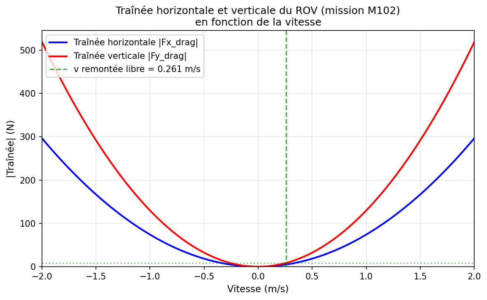

# Ordres de grandeur

Ce document présente des ordres de grandeur calculés à partir des constantes de la **mission M102**, utilisée comme référence.

## Table des matières

1. Constantes de la mission M102
2. Vitesse de remontée libre du ROV
3. Graphique : traînée horizontale et verticale du ROV
4. Traînée sur un câble de 100 m — courant perpendiculaire
5. Traînée sur un câble de 100 m — courant longitudinal

---

## 1. Constantes de la mission M102

Les paramètres suivants sont extraits du fichier `Missions/M102/Param_mission.json` :

### ROV

| Paramètre | Symbole | Valeur | Unité |
|-----------|---------|--------|-------|
| Masse | m | 30 | kg |
| Volume | V | 0,03 | m³ |
| Largeur | a | 0,4 | m |
| Longueur | b | 0,7 | m |
| Hauteur | h | 0,4 | m |
| Coefficient traînée horizontal | Cx | 0,9 | — |
| Coefficient traînée vertical | Cy | 0,9 | — |

**Sections frontales** :
- Sx = a × h = 0,4 × 0,4 = **0,16 m²**
- Sy = a × b = 0,4 × 0,7 = **0,28 m²**

### Environnement

| Paramètre | Symbole | Valeur | Unité |
|-----------|---------|--------|-------|
| Masse volumique eau | ρ_eau | 1030 | kg/m³ |
| Accélération pesanteur | g | 9,81 | m/s² |

### Câble

| Paramètre | Symbole | Valeur | Unité |
|-----------|---------|--------|-------|
| Diamètre | d | 0,001 | m |
| Masse volumique | ρ_cable | 950 | kg/m³ |
| Coefficient traînée perpendiculaire | Cx_cable | 0,9 | — |
| Coefficient frottement longitudinal | Cf_cable | 0,04 | — |

---

## 2. Vitesse de remontée libre du ROV

La **vitesse de remontée libre** est la vitesse verticale constante atteinte lorsque le ROV remonte sans propulsion (câble détendu). À l'équilibre, la traînée verticale compense exactement le poids apparent.

### Équilibre des forces

- **Poids apparent** : F_apparent = F_buoyancy − F_weight = ρ_eau × V × g − m × g
- **Traînée verticale** : Fy_drag = −Cy × 0,5 × ρ_eau × Sy × vy × |vy|

À l’équilibre (vitesse constante) : F_apparent + Fy_drag = 0

Donc : F_apparent = Cy × 0,5 × ρ_eau × Sy × vy²

### Calcul numérique

```
F_buoyancy = 1030 × 0,03 × 9,81 = 303,1 N
F_weight   = 30 × 9,81           = 294,3 N
F_apparent = 303,1 − 294,3       = 8,83 N
```

```
vy = √(2 × F_apparent / (Cy × ρ_eau × Sy))
vy = √(2 × 8,83 / (0,9 × 1030 × 0,28))
vy = √(17,66 / 259,6)
vy = √0,0680
vy ≈ 0,261 m/s
```

### Résultat

**Vitesse de remontée libre du ROV (M102)** : **vy ≈ 0,26 m/s** (environ 0,94 km/h)

---

## 3. Graphique : traînée horizontale et verticale du ROV

Les formules de traînée quadratique sont :

- **Traînée horizontale** : |Fx_drag| = Cx × 0,5 × ρ_eau × Sx × vx²
- **Traînée verticale** : |Fy_drag| = Cy × 0,5 × ρ_eau × Sy × vy²

Avec les constantes M102 :

- |Fx_drag|(v) = 0,9 × 0,5 × 1030 × 0,16 × v² = **74,2 × v²** (N)
- |Fy_drag|(v) = 0,9 × 0,5 × 1030 × 0,28 × v² = **129,8 × v²** (N)

Le graphique suivant montre ces deux traînées en fonction de la vitesse (v en m/s).



La traînée verticale est plus forte que la horizontale car Sy (0,28 m²) > Sx (0,16 m²). La ligne pointillée verte indique la vitesse de remontée libre (0,26 m/s), où |Fy_drag| = F_apparent.

### Régénération du graphique

```bash
python docs/scripts/gen_graphique_trainee_rov.py
```

Pour regénérer aussi d’éventuelles autres figures pilotées par script :

```bash
python docs/scripts/regenerate_documentation.py
```

---

## 4. Traînée sur un câble de 100 m — courant perpendiculaire

Un courant **perpendiculaire** au câble produit une vitesse relative entièrement perpendiculaire à l’axe du câble. La traînée est donc uniquement de type **perpendiculaire** (traînée normale).

### Formule

Pour un segment de longueur ds :

```
F_perpendicular = Cx_cable × 0,5 × ρ_eau × d × ds × v_perpendicular × |v_perpendicular|
```

Pour un câble rectiligne de longueur L avec v_perpendicular = V constante :

```
F_drag_total = Cx_cable × 0,5 × ρ_eau × d × L × V²
```

### Calcul numérique (M102, V = 1 m/s)

| Paramètre | Valeur |
|-----------|--------|
| Cx_cable | 0,9 |
| ρ_eau | 1030 kg/m³ |
| d | 0,001 m |
| L | 100 m |
| V | 1 m/s |

```
F_drag = 0,9 × 0,5 × 1030 × 0,001 × 100 × 1²
F_drag = 0,9 × 515 × 0,1
F_drag = 46,4 N
```

### Résultat

**Traînée pour un câble de 100 m, courant perpendiculaire de 1 m/s** : **46 N**

---

## 5. Traînée sur un câble de 100 m — courant longitudinal

Un courant **longitudinal** (parallèle au câble) produit une vitesse relative entièrement le long du câble. La traînée est donc uniquement de type **longitudinale** (frottement de surface).

### Formule

Pour un segment de longueur ds :

```
F_longitudinal = Cf_cable × 0,5 × ρ_eau × π × d × ds × v_longitudinal × |v_longitudinal|
```

Surface de frottement : π × d × ds (surface latérale du cylindre).

Pour un câble rectiligne de longueur L avec v_longitudinal = V constante :

```
F_drag_total = Cf_cable × 0,5 × ρ_eau × π × d × L × V²
```

### Calcul numérique (M102, V = 1 m/s)

| Paramètre | Valeur |
|-----------|--------|
| Cf_cable | 0,04 |
| ρ_eau | 1030 kg/m³ |
| d | 0,001 m |
| L | 100 m |
| V | 1 m/s |

```
F_drag = 0,04 × 0,5 × 1030 × π × 0,001 × 100 × 1²
F_drag = 0,04 × 515 × 0,3142
F_drag = 6,5 N
```

### Résultat

**Traînée pour un câble de 100 m, courant longitudinal de 1 m/s** : **6,5 N**

---

## 6. Synthèse

| Situation | Traînée | Remarque |
|-----------|---------|----------|
| ROV remontée libre | vy ≈ 0,26 m/s | Équilibre traînée = poids apparent |
| Câble 100 m, courant ⊥ 1 m/s | 46 N | Dominée par la traînée perpendiculaire |
| Câble 100 m, courant ∥ 1 m/s | 6,5 N | Frottement longitudinal |

Pour un courant de 1 m/s, la traînée perpendiculaire (46 N) est environ **7 fois** plus forte que la traînée longitudinale (6,5 N). Ce rapport s'explique par la différence entre les coefficients (Cx_cable = 0,9 vs Cf_cable = 0,04) et les surfaces de référence (d×ds pour la perpendiculaire, π×d×ds pour le frottement longitudinal).

**Note** : Le diamètre du câble M102 (d = 1 mm) est très faible. Pour un câble plus réaliste (d ≈ 10–20 mm), les traînées seraient multipliées par 10 à 20.

---

## Références

- Mission M102 : `Missions/M102/Param_mission.json`
- Modélisation : `docs/02_modelisation.md`
- Forces câble : `src/solvers/forces.py`
